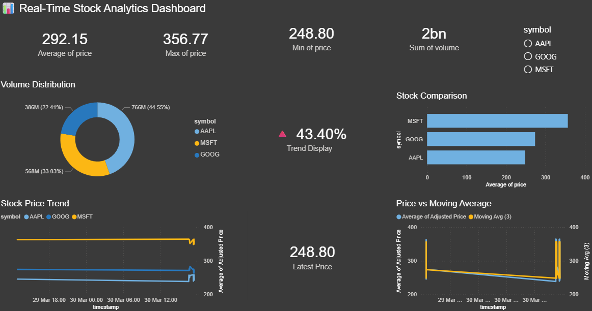
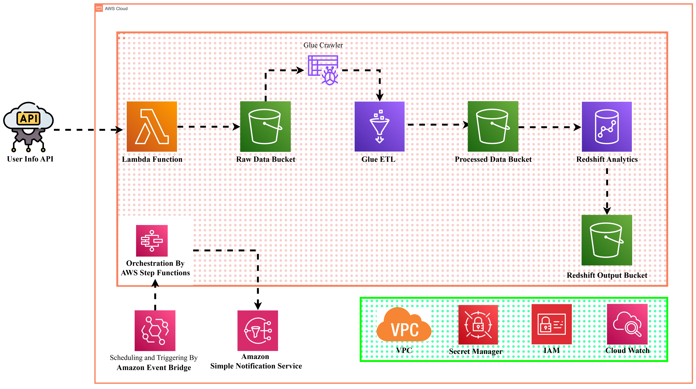

# Stock Data Pipeline and Analytics Dashboard (AWS and Power BI)

## 1. Overview

This project implements an end-to-end, serverless data pipeline for collecting, processing, and analyzing stock market data. It leverages multiple AWS services for data ingestion, storage, transformation, and querying, and integrates with Power BI for interactive data visualization.

The pipeline is designed to simulate near real-time data ingestion from an external API and transform raw data into an analytics-ready format, enabling efficient querying and dashboard reporting.

---

## 2. Architecture

The system follows a modular, cloud-native architecture:

* **AWS Lambda**: Fetches stock market data from an external API (Alpha Vantage) at regular intervals.
* **Amazon S3**: Stores data in two layers:

  * Raw layer (CSV format, partitioned by date)
  * Processed layer (Parquet format for optimized querying)
* **AWS Glue**: Performs ETL (Extract, Transform, Load) operations using PySpark to clean and convert data into Parquet format.
* **Amazon Athena**: Enables SQL-based querying directly on data stored in S3.
* **Power BI**: Provides an interactive dashboard for data visualization and analysis.

---

## 3. Data Flow

1. AWS Lambda fetches stock data (symbol, price, volume, timestamp) from the API.
2. Data is written to Amazon S3 in a partitioned structure:

   ```
   s3://bucket/raw/year=YYYY/month=MM/day=DD/
   ```
3. AWS Glue reads raw CSV data, performs schema conversion, and writes it in Parquet format:

   ```
   s3://bucket/processed/
   ```
4. AWS Glue Data Catalog registers the processed dataset as a table.
5. Amazon Athena queries the processed data using SQL.
6. Power BI consumes query results (CSV export or connector) and builds dashboards.

---

## 4. Project Structure

```
stock-data-pipeline/
│
├── lambda/
│   └── lambda_function.py        # Data ingestion logic
│
├── glue/
│   └── glue_script.py           # ETL transformation script (PySpark)
│
├── athena/
│   └── queries.sql             # SQL queries for analysis
│
├── dashboard/
│   └── powerbi_dashboard.pbix  # Power BI dashboard file
│
├── sample_data/
│   └── sample_stock_data.csv   # Example dataset
│
├── requirements.txt            # Python dependencies
└── README.md
```

---

## 5. Technology Stack

* **Programming Language**: Python
* **Libraries**: boto3, urllib / requests
* **Cloud Platform**: Amazon Web Services (AWS)

  * AWS Lambda
  * Amazon S3
  * AWS Glue (PySpark)
  * AWS Glue Data Catalog
  * Amazon Athena
* **Visualization Tool**: Power BI

---

## 6. Features

* Serverless data ingestion using AWS Lambda
* Partitioned data storage in Amazon S3 for scalability
* ETL pipeline using AWS Glue and PySpark
* Efficient querying using Amazon Athena
* Conversion of CSV data to columnar Parquet format
* Interactive dashboard with:

  * KPI cards (per stock)
  * Time-series trend analysis
  * Volume distribution
  * Filtering capabilities

---

## 7. Dashboard Description

The Power BI dashboard provides:

* **Stock Price KPIs**: Displays average price per stock symbol
* **Trend Analysis**: Line chart showing price movement over time
* **Volume Distribution**: Pie chart comparing trading volume
* **Comparative Analysis**: Bar chart for average price across symbols
* **Filters/Slicers**: Enable dynamic interaction by symbol and time

---

## 8. Sample Query (Athena)

```sql
SELECT symbol, AVG(price) AS avg_price, SUM(volume) AS total_volume
FROM stock_db.stock_parquet
GROUP BY symbol;
```

---

## 9. Setup Instructions

### Prerequisites

* AWS Account
* Configured IAM roles with S3, Glue, and Athena permissions
* Power BI Desktop

### Steps

1. Deploy Lambda function with API integration
2. Configure S3 bucket for raw and processed data
3. Create and run AWS Glue crawler to catalog data
4. Create Glue ETL job to transform CSV to Parquet
5. Query processed data using Athena
6. Export results or connect Power BI to Athena output
7. Build dashboard in Power BI

---

## 10. Key Learnings

* Designing serverless data pipelines using AWS
* Handling data partitioning and storage optimization in S3
* Implementing ETL workflows with PySpark in AWS Glue
* Querying large datasets using Athena
* Building interactive dashboards in Power BI
* Understanding data modeling and aggregation strategies

---

## 11. Future Enhancements

* Increase data volume by adding more stock symbols
* Automate scheduling using Amazon EventBridge
* Implement streaming ingestion using Amazon Kinesis
* Integrate QuickSight for cloud-native dashboards
* Add historical data tracking and trend forecasting
* Deploy dashboard via Power BI Service or web application

---

## 12. Dashboard Preview



---
## 13. Architecture Preview



---

## 14. Conclusion

This project demonstrates a complete data engineering workflow, from ingestion to visualization, using modern cloud-based tools. It highlights best practices in data pipeline design, scalable storage, and analytics, making it suitable for real-world data engineering and analytics use cases.
